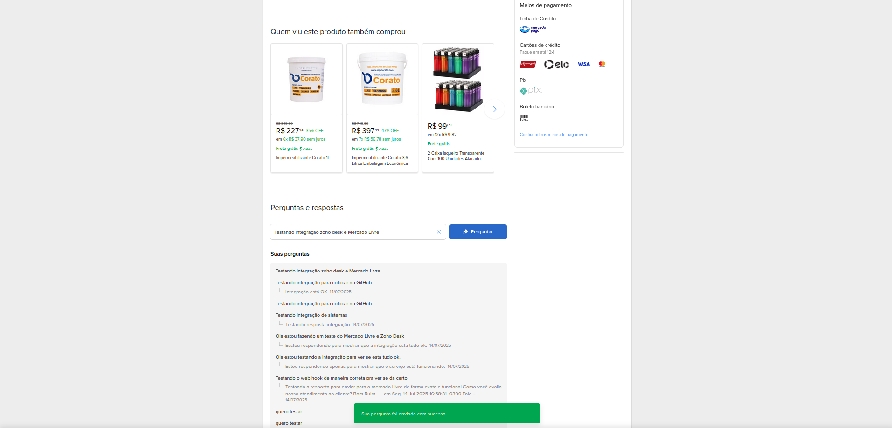
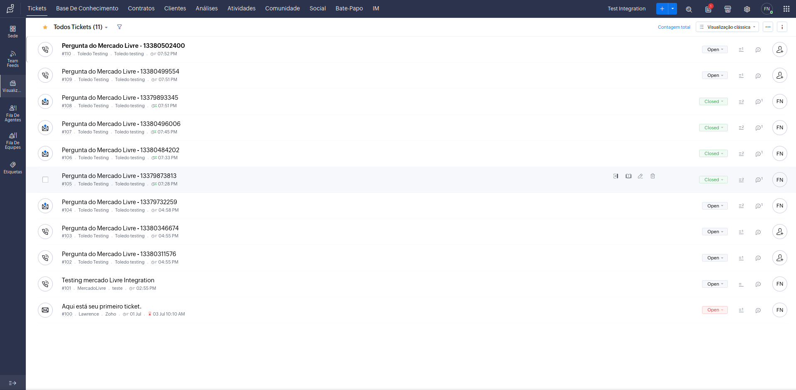
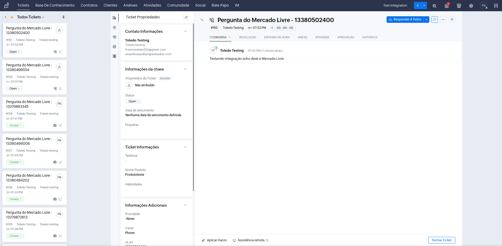
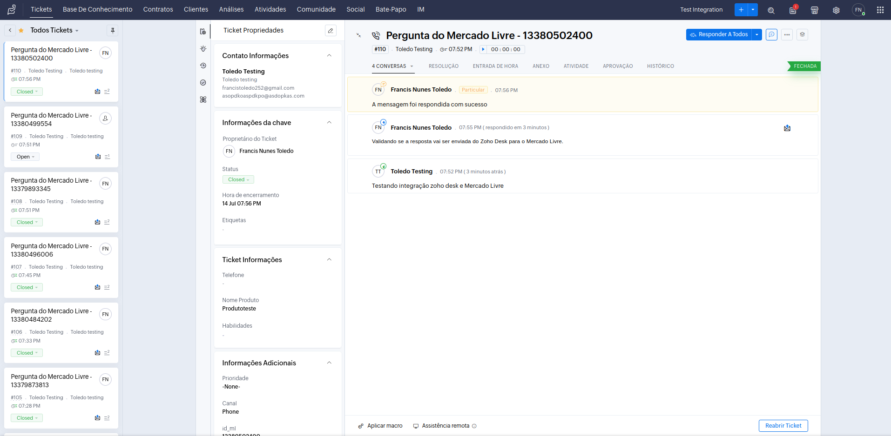
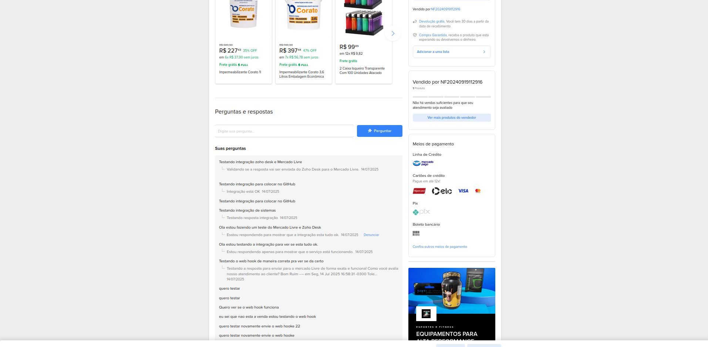
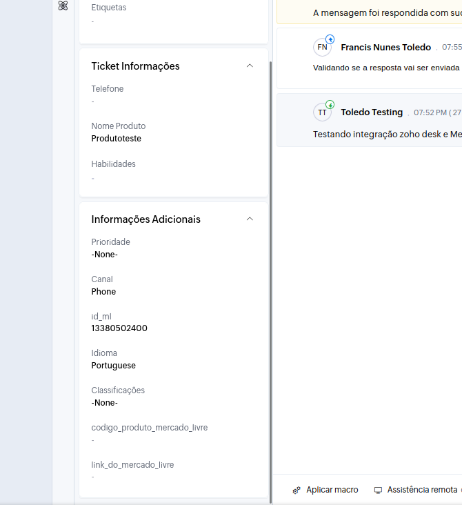

# 📘 Integração Mercado Livre ↔ Zoho Desk

Este projeto é uma **API backend escalável em TypeScript** que realiza a integração entre as plataformas **Mercado Livre** e **Zoho Desk**, permitindo o envio e recebimento de **perguntas e respostas** entre as duas.

Além da integração, o backend foi estruturado para suportar armazenamento de usuários e credenciais, com base de dados em MongoDB e arquitetura modular.

---

## 🧩 Funcionalidades

### 🔄 Integração de Perguntas e Respostas

- Quando um usuário envia uma **pergunta no Mercado Livre**, ela é capturada pelo backend e enviada como **ticket no Zoho Desk**.
- No Zoho Desk, foi criado um **campo personalizado** para armazenar o `question_id` do Mercado Livre.
- Um **workflow personalizado** com função em **Deluge** dispara automaticamente quando um ticket é respondido.
- Após o agente responder, o ticket é **fechado automaticamente** para indicar que a pergunta foi resolvida.
- Essa resposta é enviada para o backend, que a encaminha diretamente para a API do Mercado Livre.
- Todo o ciclo de comunicação entre cliente (Mercado Livre) e suporte (Zoho Desk) é automatizado.

### ⏱️ Renovação Automática de Tokens

- Para manter a integração funcionando mesmo após a expiração dos tokens de acesso, o projeto utiliza **agendadores com `node-cron`**.
- Esses agendamentos renovam automaticamente os tokens de autenticação do **Mercado Livre** e do **Zoho Desk** usando os `refresh_tokens`.
- Os arquivos responsáveis por essa automação ficam no diretório `src/cron` e são executados de forma independente, garantindo que os serviços permaneçam ativos e funcionando.

---

## 🛠 Tecnologias Utilizadas

- **TypeScript**
- **Node.js**
- **Express**
- **MongoDB**
- **Prisma ORM**
- **Zoho Desk API + Deluge**
- **Mercado Livre API**
- **Ngrok** (para testes locais de Webhook)
- **Node-Cron** (agendador de tarefas para renovação de tokens)

---

## 🖼 Imagens da Integração

### 📨 Pergunta enviada no Mercado Livre  

---

### 📝 Recebimento da pergunta nos Tickets do Zoho Desk  

---

### 💬 Abrindo a pergunta no Zoho Desk  

---

### 💬 Pergunta Respondida e ticket finalizado  

---

### 💬 Conferindo resposta no Mercado Livre  

---

### 📝 Campo personalizado com `question_id`  
